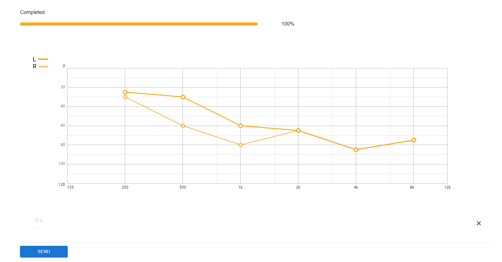

# MAIN-demo

- `npm install` to install dependencies
- `npm start` to start the web app at [localhost:3000](localhost:3000)

- Btw, there is an audiogram picture for you to try this demo under `./src/img` :)